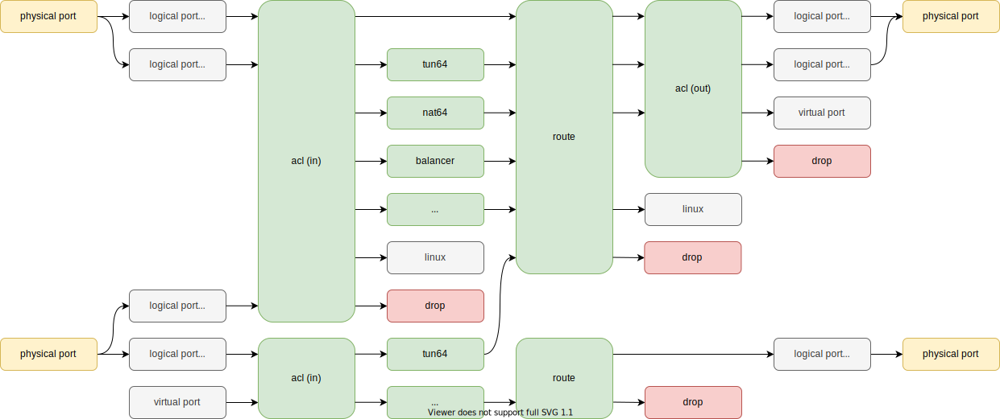

# YANET
YANET is an open-source extensible framework for software forwarding traffic based on DPDK.

## Introduction
The main objective of our solution is to be fault-tolerant and high-performance traffic processor. This is achieved due to the absence of context switching, no data race, constant complexity of algorithms, lockless.

## Features
- IPv4/IPv6 routing
- ECMP with weight
- MPLS encapsulation
- Dot1q ethernet encapsulation
- IPFW compatible ruleset with extensions
- Stateful firewall
- Layer-4 load balancer
- IPIP tunnel
- NAT64 stateless/stateful
- Telemetry via [telegraf](https://github.com/influxdata/telegraf)
- Over 200Gbps network bandwidth
- Advanced autotests

## Quick Start
You can build YANET in [docker](https://www.docker.com/) container and run it in [QEMU](https://www.qemu.org/). See [DEMO](demo/qemu).

Or build on bare metal. See [documentation](docs/build.md).
## Running Autotests
Pull docker image:
```
docker pull yanetplatform/builder
```

Add alias for run commands on docker:
```
alias yanet-builder="docker run --rm -it -v /run/yanet:/run/yanet -v \$PWD:/project yanetplatform/builder"
(for Mac: alias yanet-builder="docker run --platform linux/amd64 --rm -it -v /run/yanet:/run/yanet -v \$PWD:/project yanetplatform/builder")
```

Once setup `build_autotest` directory:
```
yanet-builder meson setup -Dtarget=autotest build_autotest
```

Compile:
```
yanet-builder meson compile -C build_autotest
```

Run autotest with all units in `autotest/units/001_one_port`:
```
yanet-builder ./autotest/yanet-autotest-run.py --prefix=build_autotest autotest/units/001_one_port
```

Or run one unit:
```
yanet-builder ./autotest/yanet-autotest-run.py --prefix=build_autotest autotest/units/001_one_port autotest/units/001_one_port/019_acl_decap_route
```

For more information about the autotests run:
```
yanet-builder ./autotest/yanet-autotest-run.py -h
```
## Dependencies
- [DPDK](https://github.com/DPDK/dpdk)
- [JSON](https://github.com/nlohmann/json)
- [Protocol Buffers](https://github.com/protocolbuffers/protobuf)

## License
[Apache License, Version 2.0](LICENSE)

## Contributing
We are glad to welcome new contributors! See the [CONTRIBUTING](CONTRIBUTING.md) file for details.
