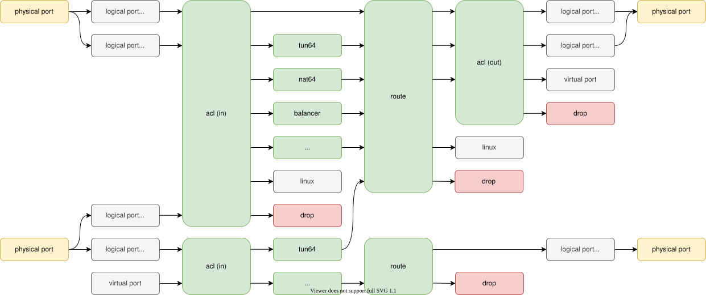

# YANET
YANET is an open-source extensible framework for software forwarding traffic based on DPDK.

## Introduction
The main objective of our solution is to be fault-tolerant and high-performance traffic processor. This is achieved due to the absence of context switching, no data race, constant complexity of algorithms, lockless.

## Features
- IPv4/IPv6 routing
- ECMP with weight
- MPLS encapsulation
- Dot1q ethernet encapsulation
- IPFW compatible ruleset with extensions
- Stateful firewall
- Layer-4 load balancer
- IPIP tunnel
- NAT64 stateless/stateful
- Telemetry via [telegraf](https://github.com/influxdata/telegraf)
- Over 200Gbps network bandwidth
- Advanced autotests

## Quick Start
You can build YANET in [docker](https://www.docker.com/) container and run it in [QEMU](https://www.qemu.org/). See [DEMO](demo/qemu).

Or build on bare metal. See [documentation](docs/build.md).
## Running Autotests

The repository runner builds and runs both test suites in Docker:
```
./run-tests.py
```

Use `./run-tests.py unit` or `./run-tests.py autotest` to run one suite. The
autotest runner defaults to two concurrent containers and four fixtures per
container. Override scheduling directly with `--jobs`, `--batch-size`, and
`--cores-per-autotest`; use `--pattern` and `--autotest-group` for fixture
selection. Builder configuration is available through `--builder-image` and
`--docker-network`. Interactive runs display a live status bar;
non-interactive CI logs receive progress checkpoints after each completed
batch.

Pull docker image:
```
docker pull yanetplatform/builder
```

Add alias for run commands on docker:
```
alias yanet-builder="docker run --rm -it -v /run/yanet:/run/yanet -v \$PWD:/project yanetplatform/builder"
(for Mac: alias yanet-builder="docker run --platform linux/amd64 --rm -it -v /run/yanet:/run/yanet -v \$PWD:/project yanetplatform/builder")
```

Once setup `build_autotest` directory:
```
yanet-builder meson setup -Dtarget=autotest build_autotest
```

Compile:
```
yanet-builder meson compile -C build_autotest
```

Run autotest with all units in `autotest/units/001_one_port`:
```
yanet-builder ./run-tests.py autotest-runner --prefix=build_autotest autotest/units/001_one_port
```

Or run one unit:
```
yanet-builder ./run-tests.py autotest-runner --prefix=build_autotest autotest/units/001_one_port autotest/units/001_one_port/019_acl_decap_route
```

For more information about the autotests run:
```
yanet-builder ./run-tests.py autotest-runner -h
```

## Running Unit Tests

To run the unit tests for the project, follow these steps:

Setup the build directory for unittest targeting:
```sh
meson setup -Dtarget=unittest build_unittest
```
Next, compile the project within the setup build directory:

```sh
meson compile -C build_unittest
```

After compilation, run all the unit tests with:

```sh
meson test -C build_unittest
```
- To view more detailed output, you can run the tests with -v flag:

```sh
meson test -C build_unittest -v
```
## Dependencies
- [DPDK](https://github.com/DPDK/dpdk)
- [JSON](https://github.com/nlohmann/json)
- [Protocol Buffers](https://github.com/protocolbuffers/protobuf)
- [PcapPlusPlus](https://github.com/seladb/PcapPlusPlus)

## License
[Apache License, Version 2.0](LICENSE)

## Contributing
We are glad to welcome new contributors! See the [CONTRIBUTING](CONTRIBUTING.md) file for details.
