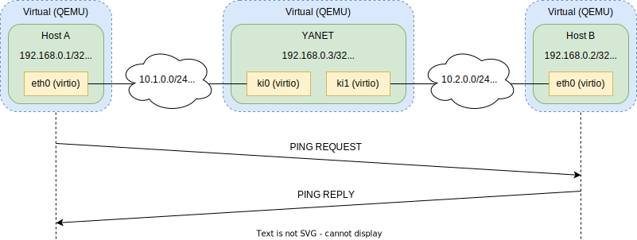
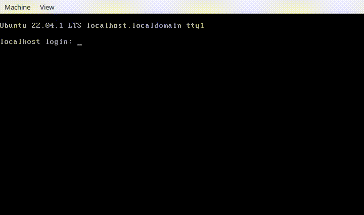
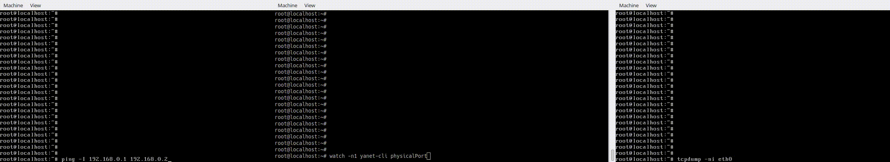

<p align="center">
  
</p>

In this demo, we will configure YANET as a router between two hosts with the addition of firewall rules for incoming traffic. We'll then check the connection by using the `ping` command.

## Dependencies
Hardware:
- CPU with 4 cores
- 8GB RAM

Software:
- OS: Ubuntu 18.04 or newer
- [docker](https://www.docker.com/)
- [QEMU](https://www.qemu.org/)
- iproute2

## Build virtual machine images
Use [d2vm](https://github.com/linka-cloud/d2vm) for build virtual machine image from Dockerfile.

### Prepare environments
Install docker, qemu and `ip` util:
```
sudo apt install docker.io qemu-system-x86 iproute2
```

Pull `d2vm` image:
```
docker pull linkacloud/d2vm:v0.2.0-1934915
```

Add alias for run commands on docker:
```
alias d2vm="docker run --rm -i -t --privileged -v /var/run/docker.sock:/var/run/docker.sock -v \$PWD:/build -w /build linkacloud/d2vm:v0.2.0-1934915"
```

Make build directory:
```
mkdir build_vm
```

### Host A
Build virtual machine image `build_vm/host_a.qcow2`:
```
d2vm build -p root -f demo/qemu/host_a/Dockerfile -o build_vm/host_a.qcow2 --force demo/qemu/host_a
```
- `-p root` - root user password.
- `-f demo/qemu/host_a/Dockerfile` - name of the Dockerfile.
- `-o build_vm/host_a.qcow2` - the output image.
- `--force` - override output qcow2 image.
- `demo/qemu/host_a` - context directory.

### Host B
Build virtual machine image `build_vm/host_b.qcow2`:
```
d2vm build -p root -f demo/qemu/host_b/Dockerfile -o build_vm/host_b.qcow2 --force demo/qemu/host_b
```

### YANET
Pull docker image with `YANET`:
```
docker pull yanetplatform/yanet
```
> [!NOTE]
> Or build it yourself:
> ```
> docker build -f yanet.Dockerfile -t yanetplatform/yanet .
> ```

Build virtual machine image `build_vm/yanet.qcow2`:
```
d2vm build -p root -f demo/qemu/yanet/Dockerfile -o build_vm/yanet.qcow2 --force demo/qemu/yanet --bootloader grub-bios
```

## Run virtual machines
Run `Host A` with one interface:
```
sudo qemu-system-x86_64 -name "Host A" \
                        -enable-kvm -cpu host -m 256 \
                        -drive file=build_vm/host_a.qcow2,format=qcow2,if=virtio \
                        -nic tap,ifname=tap_host_a,model=virtio-net-pci,mac=00:00:00:00:11:02
```
> [!NOTE]
> You can add options `-serial mon:stdio -display none` for run virtual machine without GUI.

Run `Host B` with one interface:
```
sudo qemu-system-x86_64 -name "Host B" \
                        -enable-kvm -cpu host -m 256 \
                        -drive file=build_vm/host_b.qcow2,format=qcow2,if=virtio \
                        -nic tap,ifname=tap_host_b,model=virtio-net-pci,mac=00:00:00:00:22:02
```

Run `YANET` with two interfaces with multiqueue enabled:
```
sudo qemu-system-x86_64 -name "YANET" \
                        -enable-kvm -cpu host -m 4096 -smp 4 \
                        -drive file=build_vm/yanet.qcow2,format=qcow2,if=virtio \
                        -device virtio-net-pci,netdev=dev0,mac=00:00:00:00:33:01,id=net0,vectors=17,mq=on -netdev tap,ifname=tap_yanet_ki0,id=dev0,vhost=on,queues=8 \
                        -device virtio-net-pci,netdev=dev1,mac=00:00:00:00:33:02,id=net1,vectors=17,mq=on -netdev tap,ifname=tap_yanet_ki1,id=dev1,vhost=on,queues=8
```

## Configure a network bridge
Connect `Host A` and first interface of `YANET` with bridge:
```
sudo ip link add br_host_a type bridge
sudo ip link set dev tap_host_a master br_host_a
sudo ip link set dev tap_yanet_ki0 master br_host_a
sudo ip link set dev br_host_a up
```

Connect `Host B` and second interface of `YANET` with bridge:
```
sudo ip link add br_host_b type bridge
sudo ip link set dev tap_host_b master br_host_b
sudo ip link set dev tap_yanet_ki1 master br_host_b
sudo ip link set dev br_host_b up
```

Allow forwarding traffic:
```
sudo sysctl -w net.ipv4.ip_forward=1
sudo iptables -A FORWARD -o br_host_a -j ACCEPT
sudo iptables -A FORWARD -o br_host_b -j ACCEPT
```

Check bridges:
```
sudo bridge link show
```
```
615: tap_host_a: <BROADCAST,MULTICAST,UP,LOWER_UP> mtu 1500 master br_host_a state forwarding priority 32 cost 100
616: tap_host_b: <BROADCAST,MULTICAST,UP,LOWER_UP> mtu 1500 master br_host_b state forwarding priority 32 cost 100
617: tap_yanet_ki0: <BROADCAST,MULTICAST,UP,LOWER_UP> mtu 1500 master br_host_a state forwarding priority 32 cost 100
618: tap_yanet_ki1: <BROADCAST,MULTICAST,UP,LOWER_UP> mtu 1500 master br_host_b state forwarding priority 32 cost 100
```

## Start YANET
Open `QEMU (YANET)` terminal and login with `root`/`root`.



First, we will run a command to prepare the system to launch the `yanet-dataplane`:
```
prepare.sh
```
- insert `vhost_net`, `uio_pci_generic` modules.
- reserve and mount hugepages.
- bind interfaces to `uio_pci_generic` module.
- make runtime directory `/run/yanet`.
---

Run `yanet-dataplane`:
```
yanet-dataplane -c /etc/yanet/dataplane.conf &
```

> [!NOTE]
> ```
> /etc/yanet/dataplane.conf:
> {
>     "ports": [                  # configure physical ports
>       {
>         "interfaceName": "ki0",
>         "pci": "0000:00:03.0",  # pci id of device
>         "coreIds": [
>             2                   # these cores will serve the RX queues of this device
>         ],
>         "symmetric_mode": true, # enable symmetric mode
>                                 # need only for a virtual device where the number of RX queues must be equal to the number TX queues
> 
>         "rssFlags": []          # virtio not support RSS. disable it
>       },
>       {
>         "interfaceName": "ki1",
>         "pci": "0000:00:04.0",
>         "coreIds": [
>             3
>         ],
>         "symmetric_mode": true,
>         "rssFlags": []
>       }
>     ],
>     "workerGC": [
>       1                         # bind 'GC' worker on core #1
>     ],
>     "controlPlaneCoreId": 0     # bind 'slowworker' on core #0
> }
> ```
---

Run `yanet-controlplane`:
```
yanet-controlplane -c /etc/yanet/controlplane.conf &
```

<p align="center">
  
</p>

> [!NOTE]
> ```
> /etc/yanet/controlplane.conf:
> {
>   "modules": {                     # configure modules
>     "lp0": {
>       "type": "logicalPort",
>       "physicalPort": "ki0",
>       "nextModule": "acl0"         # forward traffic from physical port 'ki0' (without vlan) to ACL
>     },
>     "lp1": {
>       "type": "logicalPort",
>       "physicalPort": "ki1",
>       "nextModule": "acl0"         # forward traffic from physical port 'ki1' (without vlan) to ACL
>     },
>     "acl0": {
>       "type": "acl",
>       "firewall": "firewall.conf", # ruleset
>       "nextModules": [
>         "route0"                   # list of available modules for forward traffic
>       ]
>     },
>     "route0": {
>       "type": "route",             # route module with 'default' routing table
>       "interfaces": {
>         "lo": {
>           "ipAddresses": [         # list host addresses
>             "192.168.0.3",
>             "2afe::3"
>           ]
>         },
>         "ki0": {
>           "ipAddresses": [         # list host addresses
>             "10.1.0.1",
>             "2000:1::1"
>           ],
>           "neighborIPv4Address": "10.1.0.2",  # set neighbor address
>           "neighborIPv6Address": "2000:1::2", # set neighbor address
>           "nextModule": "lp0"                 # forward traffic to physical port 'ki0' (without vlan)
>         },
>         "ki1": {
>           "ipAddresses": [         # list host addresses
>             "10.2.0.1",
>             "2000:2::1"
>           ],
>           "neighborIPv4Address": "10.2.0.2",  # set neighbor address
>           "neighborIPv6Address": "2000:2::2", # set neighbor address
>           "nextModule": "lp1"                 # forward traffic to physical port 'ki1' (without vlan)
>         }
>       }
>     }
>   }
> }
> ```
> ```
> /etc/yanet/firewall.conf:
> :BEGIN                               # always start ruleset with ':BEGIN' section
> add skipto :IN ip from any to any in # incoming traffic skip to ':IN' section
> add allow ip from any to any         # allow all other traffic (outgoing traffic)
> 
> :IN                                  # ':IN' section
> add deny udp from any to 10.2.0.2 53 # deny traffic where destination address 10.2.0.2 and UDP port 53
> add deny ip from any to any frag     # deny fragmented traffic
> add allow ip from any to any         # allow all other traffic
> ```
---

Wait a moment and check the processes have been started:
```
yanet-cli version
```
```
application   version  revision  hash      custom
------------  -------  --------  --------  -------
dataplane     0.0      0         00000000  develop
controlplane  0.0      0         00000000  develop
cli           0.0      0         00000000  develop
```
---

Add static routes:
```
yanet-cli rib static insert default 10.1.0.0/24 10.1.0.2
yanet-cli rib static insert default 10.2.0.0/24 10.2.0.2
yanet-cli rib static insert default 2000:1::/64 2000:1::2
yanet-cli rib static insert default 2000:2::/64 2000:2::2
yanet-cli rib static insert default 192.168.0.1/32 10.1.0.2
yanet-cli rib static insert default 192.168.0.2/32 10.2.0.2
yanet-cli rib static insert default 2afe::1/128 2000:1::2
yanet-cli rib static insert default 2afe::2/128 2000:2::2
```
- `default` - table name (VRF).
- `2afe::2/128` - prefix.
- `2000:2::2` - nexthop.
---

Ping neighbors:
```
ping -c1 10.1.0.2
ping -c1 10.2.0.2
ping -c1 2000:1::2
ping -c1 2000:2::2
```
---

Check MAC addresses of the neighbors have been discovered:
```
yanet-cli route interface
```
```
module  interface  address              neighbor_v4  neighbor_v6  neighbor_mac_address_v4  neighbor_mac_address_v6  next_module
------  ---------  -------------------  -----------  -----------  -----------------------  -----------------------  -----------
route0  ki0        10.1.0.1,2000:1::1   10.1.0.2     2000:1::2    00:00:00:00:11:02        00:00:00:00:11:02        lp0
route0  ki1        10.2.0.1,2000:2::1   10.2.0.2     2000:2::2    00:00:00:00:22:02        00:00:00:00:22:02        lp1
route0  lo         192.168.0.3,2afe::3  n/s          n/s          n/s                      n/s                      
```

## Let's try to communicate
<p align="center">
  
</p>

Open `QEMU (Host A)` terminal and login with `root`/`root`.

Ping `Host B` (IPv4):
```
ping -c3 192.168.0.2
```
```
PING 192.168.0.2 (192.168.0.2) 56(84) bytes of data.
64 bytes from 192.168.0.2: icmp_seq=1 ttl=63 time=0.412 ms
64 bytes from 192.168.0.2: icmp_seq=2 ttl=63 time=0.478 ms
64 bytes from 192.168.0.2: icmp_seq=3 ttl=63 time=0.469 ms
```

Ping `Host B` (IPv6):
```
ping -c3 2afe::2
```
```
PING 2afe::2(2afe::2) 56 data bytes
64 bytes from 2afe::2: icmp_seq=1 ttl=63 time=0.446 ms
64 bytes from 2afe::2: icmp_seq=2 ttl=63 time=0.438 ms
64 bytes from 2afe::2: icmp_seq=3 ttl=63 time=0.564 ms
```

Success, `Host B` responded!

## Useful commands
Show ports stats:
```
yanet-cli physicalPort
```
```
moduleName  link  speed  rx_packets  rx_bytes  rx_errors  rx_drops  tx_packets  tx_bytes  tx_errors  tx_drops
----------  ----  -----  ----------  --------  ---------  --------  ----------  --------  ---------  --------
ki0         up    10G    445         47323     0          0         417         43606     0          0
ki1         up    10G    677         73470     0          0         618         67404     0          0
```
---

Show firewall ruleset:
```
yanet-cli fw show
```
```
id  ruleno  label   counter  rule
--  ------  ------  -------  -------------------------------------
1   2       :BEGIN  570      skipto :IN ip from any to any in // 6
2   4       :BEGIN  0        allow ip from any to any
3   6       :IN     0        deny udp from any to 10.2.0.2 53
4   8       :IN     0        deny ip from any to any frag
5   10      :IN     570      allow ip from any to any
```
---

Show RIB:
```
yanet-cli rib prefixes
```
```
vrf      priority  prefix          protocol  peer  table_name  path_information  nexthop    labels  local_preference  aspath  origin  med  communities  large_communities
-------  --------  --------------  --------  ----  ----------  ----------------  ---------  ------  ----------------  ------  ------  ---  -----------  -----------------
default  10000     10.1.0.0/24     static    ::                10.1.0.2          10.1.0.2           0                                 0    n/s          n/s
default  10000     10.2.0.0/24     static    ::                10.2.0.2          10.2.0.2           0                                 0    n/s          n/s
default  10000     192.168.0.1/32  static    ::                10.1.0.2          10.1.0.2           0                                 0    n/s          n/s
default  10000     192.168.0.2/32  static    ::                10.2.0.2          10.2.0.2           0                                 0    n/s          n/s
default  10000     2000:1::/64     static    ::                2000:1::2         2000:1::2          0                                 0    n/s          n/s
default  10000     2000:2::/64     static    ::                2000:2::2         2000:2::2          0                                 0    n/s          n/s
default  10000     2afe::1/128     static    ::                2000:1::2         2000:1::2          0                                 0    n/s          n/s
default  10000     2afe::2/128     static    ::                2000:2::2         2000:2::2          0                                 0    n/s          n/s
default  10000     fe80::/64       static    ::                                  ::                 0                                 0    n/s          n/s
```
---

Lookup to FIB:
```
yanet-cli route lookup route0 192.168.0.1
```
```
ingress_physical_ports  prefix          nexthop   egress_interface  labels
----------------------  --------------  --------  ----------------  ------
ki0,ki1                 192.168.0.1/32  10.1.0.2  ki0               
```
<br/>

```
yanet-cli route lookup route0 192.168.0.2
```
```
ingress_physical_ports  prefix          nexthop   egress_interface  labels
----------------------  --------------  --------  ----------------  ------
ki0,ki1                 192.168.0.2/32  10.2.0.2  ki1               
```
---

You can make changes in `/etc/yanet/controlplane.conf` or `/etc/yanet/firewall.conf` and run:
```
yanet-cli reload
```
